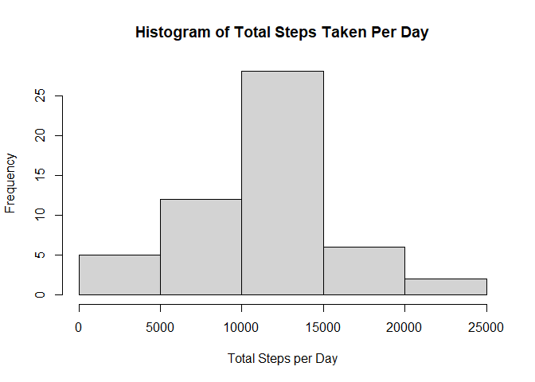

## Loading and preprocessing the data
First, I unzip the file and read the csv file. I add the data to variable activity and summarize it.

```r
unzip("./activity.zip")
activity <- read.csv("activity.csv")
summary(activity)
```

```
##      steps            date              interval     
##  Min.   :  0.00   Length:17568       Min.   :   0.0  
##  1st Qu.:  0.00   Class :character   1st Qu.: 588.8  
##  Median :  0.00   Mode  :character   Median :1177.5  
##  Mean   : 37.38                      Mean   :1177.5  
##  3rd Qu.: 12.00                      3rd Qu.:1766.2  
##  Max.   :806.00                      Max.   :2355.0  
##  NA's   :2304
```


## What is mean total number of steps taken per day?
1. Calculate the number of steps taken per day, I ignore the missing values.

```r
totalStepsPerDay <- aggregate(steps~date,activity,sum,na.rm=TRUE)
```
2. Make the histogram of total number of steps taken per day, this time I use base plotting  

```r
hist(totalStepsPerDay$steps,xlab="Total Steps per Day", main = "Histogram of Total Steps Taken Per Day")
```

<!-- -->
  
3. Calculate the mean of total number of steps taken per day  

```r
meanTotalSteps <- mean(totalStepsPerDay$steps)
meanTotalSteps
```

```
## [1] 10766.19
```
Mean of total number of steps taken per day = 1.0766189\times 10^{4}  
4. Calculate the median of total number of steps taken per day  

```r
medianTotalSteps<-median(totalStepsPerDay$steps)
medianTotalSteps
```

```
## [1] 10765
```
Median of total number of steps taken per day = 10765 

## What is the average daily activity pattern?
1. Make a time series plot (i.e. type = "l") of the 5-minute interval (x-axis) and the average number of steps taken, averaged across all days (y-axis)  

```r
stepsPerInterval <- aggregate(steps~interval,activity,mean,na.rm=TRUE)
plot(stepsPerInterval$interval,stepsPerInterval$steps,type="l", xlab = "Interval", ylab = "Average steps")
```

<!-- -->
  
2. Which 5-minute interval, on average across all the days in the dataset, contains the maximum number of steps?  

```r
intervalWithMaxStep <- stepsPerInterval[which.max(stepsPerInterval$steps),]$interval
intervalWithMaxStep
```

```
## [1] 835
```
  
The interval that contains the maximum number of steps = 835  

## Imputing missing values
1. Calculate and report the total number of missing values in the dataset

```r
totalNA <- sum(is.na(activity$steps))
totalNA
```

```
## [1] 2304
```
Total missing values in the dataset = 2304  
2. Devise a strategy for filling in all of the missing values in the dataset. I fill the missing values with average steps per that interval. I make a function called getMeanSteps to get the average steps of particular interval.

```r
getMeanSteps <- function(interval){
     stepsPerInterval[stepsPerInterval$interval==interval,]$steps
 }
```
  
3. Create a new dataset that is equal to the original dataset but with the missing data filled in.I create a new dataset called `activityNoNa`  

```r
activityNoNa <- activity
for(i in 1:nrow(activityNoNa)){
  if(is.na(activityNoNa[i,]$steps)){
    activityNoNa[i,]$steps <- getMeanSteps(activityNoNa[i,]$interval)
  }
}
```

4. Make a histogram of the total number of steps taken each day.    


```r
totalStepsPerDayNoNa <- aggregate(steps~date,activityNoNa,sum)
hist(totalStepsPerDayNoNa$steps,xlab="Total Steps per Day", main = "Histogram of Total Steps Taken Per Day")
```

<!-- -->
  
Calculate and report the mean and median total number of steps taken per day.  

```r
meanTotalStepsNoNa <- mean(totalStepsPerDayNoNa$steps)
medianTotalStepsNoNa <- median(totalStepsPerDayNoNa$steps)
differMedian <- medianTotalStepsNoNa - medianTotalSteps
```
  
Mean of total number of steps taken per day = 1.0766189\times 10^{4}, the number doesn't changed from previous dataset that contains missing values.  
Median of total number of steps taken per day = 1.0766189\times 10^{4}, the median of original dataset = 10765, the number changed by 1.1886792  


## Are there differences in activity patterns between weekdays and weekends?
1. Create a new factor variable in the dataset with two levels -- "weekday" and "weekend" indicating whether a given date is a weekday or weekend day.  

```r
activityNoNa$date <- as.Date(strptime(activityNoNa$date, format="%Y-%m-%d"))
activityNoNa$day <- weekdays(activityNoNa$date)
for(i in 1:nrow(activityNoNa)){
  if(activityNoNa[i,]$day %in% c("Saturday","Sunday")){
    activityNoNa[i,]$day <- "weekend"
  }
  else{
    activityNoNa[i,]$day <- "weekday"
  }
}
```
2. Create a new factor variable in the dataset with two levels -- "weekday" and "weekend" indicating whether a given date is a weekday or weekend day. I use lattice plotting.  

```r
averageStepsByDay <- aggregate(steps~interval + day, activityNoNa,mean)
library(lattice)
xyplot(steps ~ interval | day, averageStepsByDay, type="l", layout = c(1,2), xlab = "Interval", ylab = "Number of Steps")
```

<!-- -->
